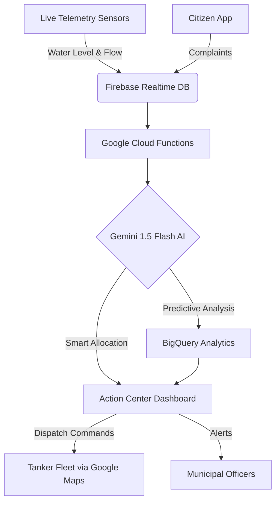
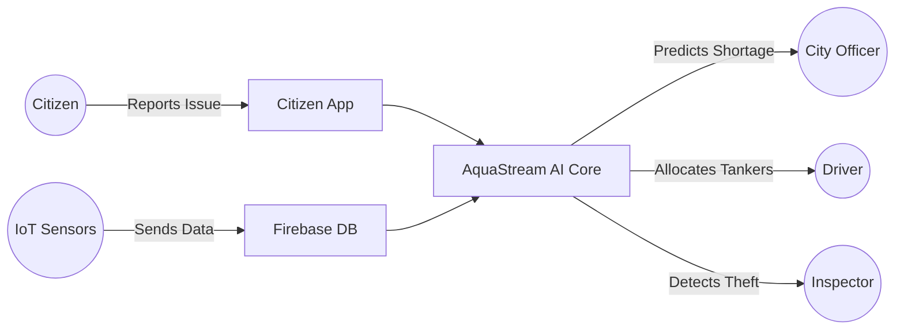

# AquaStream AI 🌊

**AI-Powered Urban Water Crisis Prevention & Smart Resource Allocation Platform**  
*Built for Bengaluru Smart Cities Mission*

---

## 🛑 Problem Statement
Bengaluru, like many major metropolitan areas, faces a severe urban water crisis. The current water management approach is heavily **reactive**—authorities only respond *after* a crisis has occurred, leading to dry borewells, delayed tanker deployments, rampant water theft, and severe citizen distress. There is no unified, intelligent system to predict shortages, detect leakages, or optimally route emergency water supplies.

## 💡 Brief Solution
**AquaStream AI** is a premium City Command Center that shifts urban water management from reactive to **predictive**. Powered by the Gemini 1.5 Flash API, our platform analyzes live telemetry data (water levels, population density, historical usage) across 6 major Bengaluru neighborhoods to predict shortages 7 days in advance, automatically allocate emergency water tankers, detect pipeline leakages, flag water theft anomalies, and recommend sustainability initiatives.

## 🚀 Opportunities
- **Government Integration:** Direct integration with BWSSB (Bangalore Water Supply and Sewerage Board).
- **Smart City Scalability:** Can be deployed to any tier-1 city facing similar water infrastructure challenges.
- **Resource Optimization:** Millions of liters of water and crores of rupees can be saved annually by plugging leakages and optimizing tanker routes.
- **Sustainability:** Directly contributes to UN Sustainable Development Goal 6 (Clean Water and Sanitation).

## ⭐ USP (Unique Selling Proposition)
**Not Reactive. Predictive.**  
While other solutions try to manage a water crisis, AquaStream AI uses Google's Gemini AI to prevent the crisis *before* it happens through predictive forecasting and anomaly detection. 

## ⚙️ Key Features
1. **AI Water Crisis Prediction:** Gemini predicts which zones will face shortages in the next 7 days and provides preventive action plans.
2. **Smart Tanker Allocation:** AI optimally routes exactly 15 emergency tankers based on hospital density, criticality, and population, providing human-readable reasoning for every dispatch.
3. **Leakage Detection Engine:** Flags probable pipeline leakage zones based on abnormal pressure drops and complaint frequency.
4. **Water Theft Detection:** Identifies abnormal usage patterns in commercial and industrial zones.
5. **Citizen Complaint Intelligence:** Automatically scores the urgency of citizen reports (No Supply, Contamination, Low Pressure).
6. **Rainwater Harvesting Recommender:** Suggests the highest-ROI zones for rooftop harvesting infrastructure.
7. **Sustainability Dashboard:** Tracks water saved, carbon footprint reduced, and tanker costs mitigated in real-time.

---

## 🔄 Process Flow Diagram

## 👥 Use Case Diagram

## 🏗️ Architecture Diagram
AquaStream AI utilizes a modern, serverless Google Cloud architecture for maximum scalability and reliability:

- **Frontend:** React, Tailwind CSS v4, TypeScript, Recharts, Lucide React
- **Authentication:** Firebase Auth
- **Database:** Firebase Firestore & Firebase Realtime Database
- **Hosting:** Firebase Hosting & Google Cloud Run
- **AI Engine:** Google Gemini 1.5 Flash API (via Vertex AI)
- **Backend Logic:** Google Cloud Functions, Cloud Scheduler
- **Analytics & Geo:** BigQuery, Google Maps Integration, Cloud Monitoring

*(A highly visual interactive Architecture Diagram is built directly into the React Dashboard UI).*

---

## 📱 MVP Snapshots
Our MVP features a dark-themed, enterprise-grade government control room aesthetic using glassmorphism and Google Blue (`#4285F4`) primary actions.
*(Insert screenshots of Executive Overview, AI Command Center, and Forecast Analytics here during PPT creation).*

## 🔮 Future Development (Bonus Innovation)
- **Voice-Based AI Officer Assistant:** Ask Gemini for live status updates via voice.
- **WhatsApp Integration:** Citizens can report leakages natively via WhatsApp bots.
- **Digital Twin City Planning:** 3D mapping of underground pipeline networks.
- **Satellite Prediction Readiness:** Integrating with Earth Engine for groundwater depletion tracking.

## 💰 Cost Estimation (At Scale)
- **Google Cloud Run & Functions:** Serverless scaling minimizes idle costs (estimated ₹5,000/month for medium traffic).
- **Gemini API:** Highly cost-effective using the 1.5 Flash model (fraction of a cent per prompt).
- **Firebase:** Generous free tier handles all MVP database and hosting needs; scales linearly.
- **ROI:** Estimated savings of ₹50 Lakhs/month in reduced water loss and optimized tanker fuel.

## 🎥 Demo Video
*(Link to Hackathon Demo Video to be added here)*

## 💻 GitHub Repository
[AquaStream AI on GitHub](https://github.com/lochangowda10/AquaStream)
